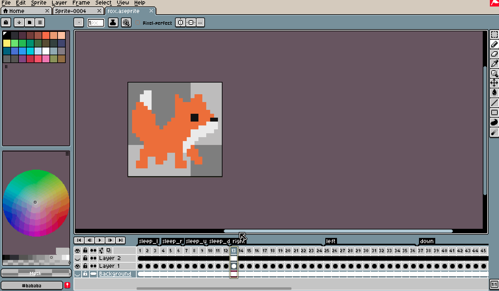
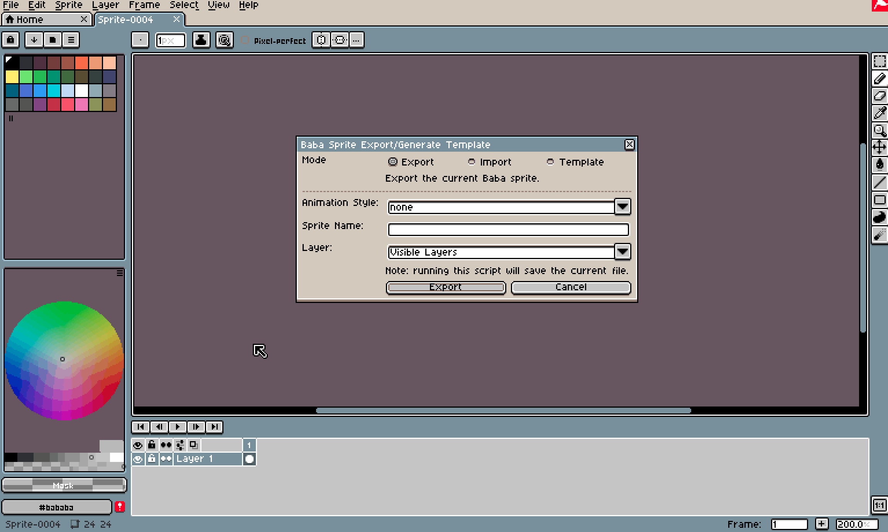

# Baba Aseprite Exporter
A script for exporting baba sprites created in aseprite

## Requirements
- Requires Aseprite 1.2.22+

## Installing/Usage
- Copy baba_sprite_export.lua to the Aseprite scripts directory
  - You can find this by opening Aseprite and go to *File > Scripts > Open Scripts Folder*
- Run the script in Aseprite while on a current sprite to get a dialog box
- The exported sprites will be in a folder `<path to aseprite file>\<Sprite name>_out`

# Changelog (because I forgot to do this before)
- 1/25/22
  - Fixed inaccurate results when importing baba sprites with color encodings other than RGB
- 12/10/21
  - Fixed not being able to export sprites with "Animated" style
- 8/31/21
  - Added the ability to import a baba sprite from a sequence of pngs
- 8/26/21
  - Fixed "character" template not setting sleep tags correctly
  - If exporting, the dialog tries to auto-guess which animation type you are exporting based on which tags are present. For tiled_slices, it looks at the current slices
- 5/25/21
  - Added ability to generate templates
  - Added "tiled_slices" option as an alternative for "tiled" animation style


# Features
(Note: these features rely on the aseprite file formatted in a specific way. See the "Tag Specification" section)
## Importing
Import a baba sprite from a sequence of pngs that are formatted similar to the base game. This will create a  aseprite file with the baba sprite, formatted in a way that is exportable with the export feature.


---
## Exporting
You can export an Aseprite file formatted accordingly into the required png files needed for Baba Is You. This will create a folder in the same directory as the aseprite file. The contents of this folder can be copied to `<baba install folder>\Data\Sprites` for the entire game or `<baba install folder>\Data\Worlds\<levelpack folder>\Sprites` for levelpack specific sprites.



---
## Templates
To save the hassle of making the tags manually, there is an option to make a template sprite. This creates a new aseprite file with the tags already set based on the "Tag Specification section" (see below). So you can focus on filling in the frames.



---
# Options
- **Animation Style** - the sprite format (details explained in the next section)
- **Sprite Name** - the name of the sprite. The names of the output folder and exported images will start with this.
  - For exporting "Text" animation style, the folder will be `<sprite name>_out` but the exported images will have `text_` prepended to the name.
- **Layer** - which layer to build the output sprites from
  - Special options "All layers" and "Visible Layers" use multiple layers

## Animation Style
The animation style option corresponds to the 6 modes of animation (plus two extras) supported in Baba Is You:
- **None** - sprite remains the same (rock, flag, box)
- **Directional** - sprite changes based on the direction it is facing (ghost, skull, hand)
- **Animated** - sprite changes at every turn, ignoring directions (bubble, cog, bat)
- **Animated Directional** - sprite changes at every turn, but the sequence of sprites is determined by the direction (belt)
- **Character** - sprite changes whenever the object moves. Sequence of sprites is influenced by direction. Also has sleep sprites. (baba, keke, me)
- **Tiled** - sprite changes based on if its near other objects of the same sprite (wall, brick, fence)
- **Text** - this isn't an actual animation style in Baba, but it is used to export text sprites. Under the hood, it uses the "None" animation style and prepends `text_` to the output file names
- **Tiled Slices** - this isn't an actual animation style in Baba. It's exactly like "Tiled" but the format uses an Aseprite feature called slices. Basically think a tilemap editor.

(Note: when saying that the sprite remains the same, we ignore the wobble animation.)

## Tag Specification
The Aseprite file needs to tell the script which frames to export while following the animation style requirements. This is done with Aseprite tags, which specify a range of frames. Each animation style needs a certain set of tags, each with a specific number of frames. The specification is listed below.

Some notes about interpreting the specification:
- Tag names as case-insensitive
- If the style requires 4 wobble animations, the frame layout would look like this:
```
                                                    Tag
 ____________________________________________________________________________________________________________
|                                                                                                            |
         Wobble 1                   Wobble 2                   Wobble 3                    Wobble 4
 _________________________  _________________________  _________________________  ___________________________
|                         ||                         ||                         ||                           | 
 Frame 1, Frame 2, Frame 3  Frame 4, Frame 5, Frame 6  Frame 7, Frame 8, Frame 9  Frame 10, Frame 11 Frame 12
```

### Animation Style - None
- Tag names: neutral
- \# of frames for each tag: 3 (1 wobble animation)

### Animation Style - Text
- Tag names: text
- \# of frames for each tag: 3 (1 wobble animation)
 

### Animation Style - Directional
- Tag names: left, up, right, down
- \# of frames for each tag: 3 (1 wobble animation)

### Animation Style - Animated
- Tag names: neutral
- \# of frames for each tag: 12 (4 wobble animations)
  - Wobble animations within each tag are cycled at every turn.

### Animation Style - Animated Directional
- Tag names: left, up, right, down
- \# of frames for each tag: 12 (4 wobble animations)
  - Wobble animations within each tag are cycled at every turn.

### Animation Style - Character
- Tag names: left, up, right, down, sleep_l, sleep_u, sleep_r, sleep_d
- \# of frames for tags `left, up, right, down`: 12 (4 wobble animations)
  - Wobble animations within each tag are cycled whenever the object moves. This is their walking animation.
- \# of frames for tags `sleep_l, sleep_u, sleep_r, sleep_d`: 3 (1 wobble animation)

### Animation Style - Tiled
- Tag names: neutral, r, u, ru, l, rl, ul, rul, d, rd, ud, rud, ld, rld, uld, ruld
  - Each letter represents on which sides the object is connected to
- \# of frames for each tag: 3 (1 set of wobble animations)