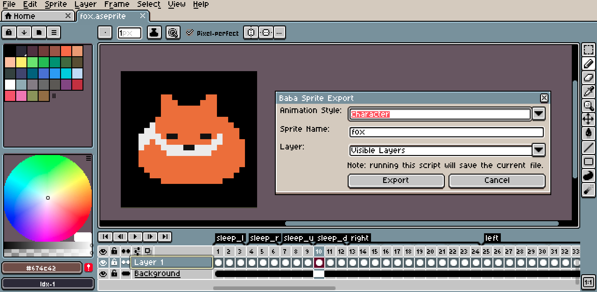

# Baba Aseprite Exporter
A script for exporting baba sprites created in aseprite

## Requirements
- Requires Aseprite 1.2.11+

## Installing/Usage
- Copy baba_sprite_export.lua to the Aseprite scripts directory
  - You can find this by opening Aseprite and go to *File > Scripts > Open Scripts Folder*
- Run the script in Aseprite while on a current sprite to get a dialog box
- The exported sprites will be in a folder `<path to aseprite file>\<Sprite name>_out`



## Options
- **Animation Style** - the sprite format (details explained in the next section)
- **Sprite Name** - the name of the sprite. The names of the output folder and exported images will start with this.
  - For exporting "Text" animation style, the folder will be `<sprite name>_out` but the exported images will have `text_` prepended to the name.
- **Layer** - which layer to build the output sprites from
  - Special options "All layers" and "Visible Layers" use multiple layers

## Animation Style
The animation style option corresponds to the 6 modes of animation (plus one extra) supported in Baba Is You:
- **None** - sprite remains the same (rock, flag, box)
- **Directional** - sprite changes based on the direction it is facing (ghost, skull, hand)
- **Animated** - sprite changes at every turn, ignoring directions (bubble, cog, bat)
- **Animated Directional** - sprite changes at every turn, but the sequence of sprites is determined by the direction (belt)
- **Character** - sprite changes whenever the object moves. Sequence of sprites is influenced by direction. Also has sleep sprites. (baba, keke, me)
- **Tiled** - sprite changes based on if its near other objects of the same sprite (wall, brick, fence)
- **Text** - this isn't an actual animation style in Baba, but it is used to export text sprites. Under the hood, it uses the "None" animation style and prepends `text_` to the output file names

(Note: when saying that the sprite remains the same, we ignore the wobble animation.)

The Aseprite file needs to tell the script which frames to export while following the animation style requirements. This is done with Aseprite tags, which specify a range of frames. Each animation style needs a certain set of tags, each with a specific number of frames. The specification is listed in the next section.


- Note: the script treats tag names as case-insensitive
- Note: some of the animation styles require multiple sets of wobble animations in one tag. Each wobble animation is 3 frames. So the frame layout would be
```
[Set 1, wobble frame 1] | [Set 1, wobble frame 2] | [Set 1, wobble frame 3] | [Set 2, wobble frame 1] | [Set 2, wobble frame 2] | [Set 2, wobble frame 3] ...
```

## Tag Specification
### Animation Style - None
- Tag names: neutral
- \# of frames for each tag: 3 (1 set of wobble animation)

### Animation Style - Text
- Tag names: text
- \# of frames for each tag: 3 (1 set of wobble animation)
 

### Animation Style - Directional
- Tag names: left, up, right, down
- \# of frames for each tag: 3 (1 set of wobble animation)

### Animation Style - Animated
- Tag names: neutral
- \# of frames for each tag: 12 (4 sets of wobble animations in sequential order)

### Animation Style - Animated Directional
- Tag names: left, up, right, down
- \# of frames for each tag: 12 (4 sets of wobble animations in sequential order)

### Animation Style - Character
- Tag names: left, up, right, down, sleep_l, sleep_u, sleep_r, sleep_d
- \# of frames for each normal tag: 12 (4 sets of wobble animations in sequential order)
- \# of frames for each sleep tag: 3 (1 set of wobble animation)

### Animation Style - Tiled
- Tag names: neutral, r, u, ru, l, rl, ul, rul, d, rd, ud, rud, ld, rld, uld, ruld
  - Each letter represents on which sides the object is connected to
- \# of frames for each tag: 3 (1 set of wobble animations)